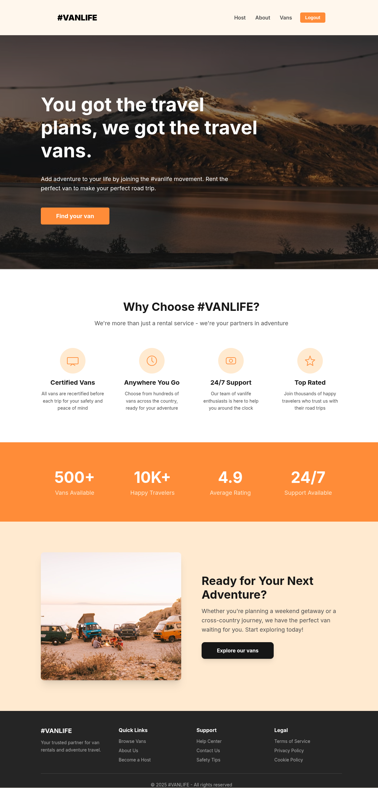
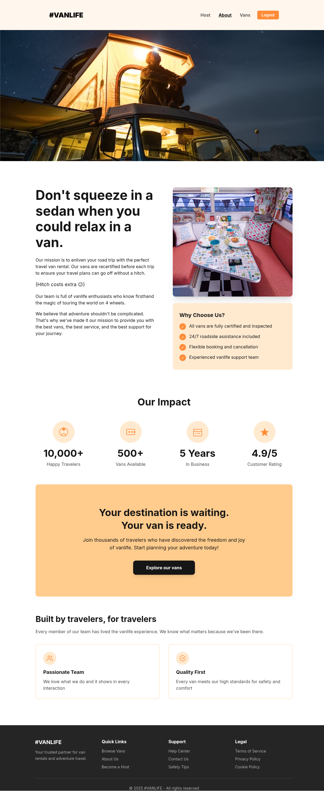
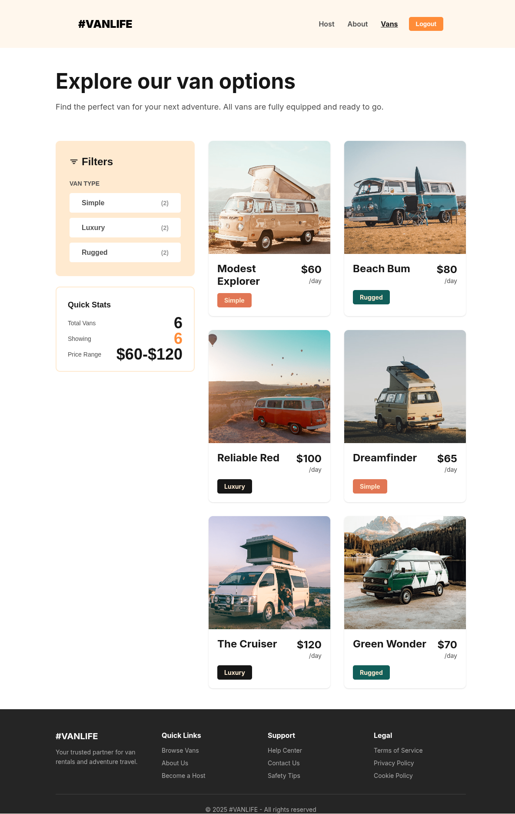
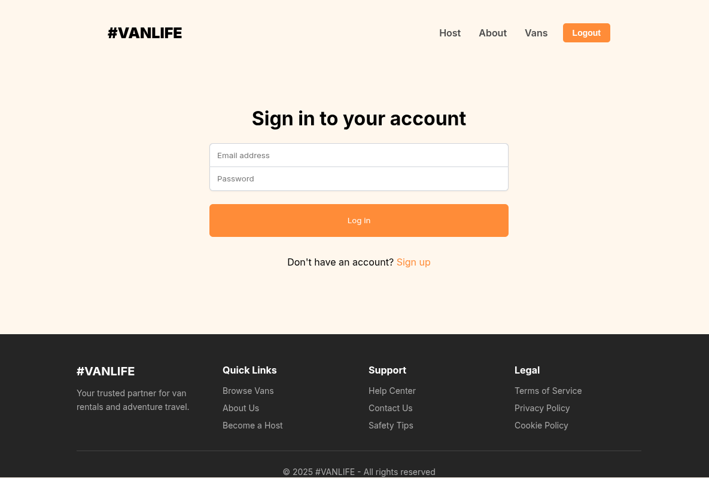
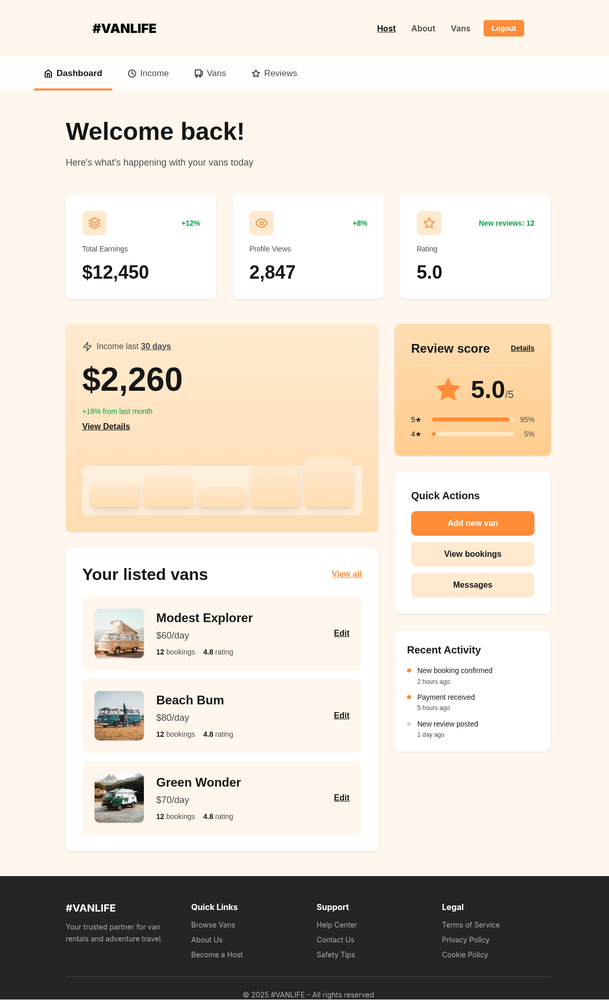
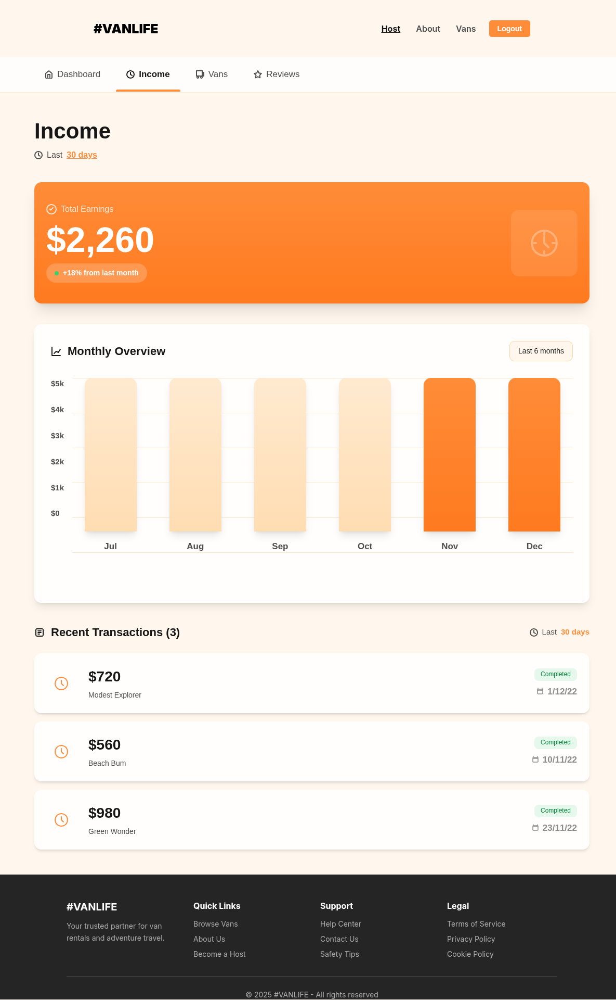
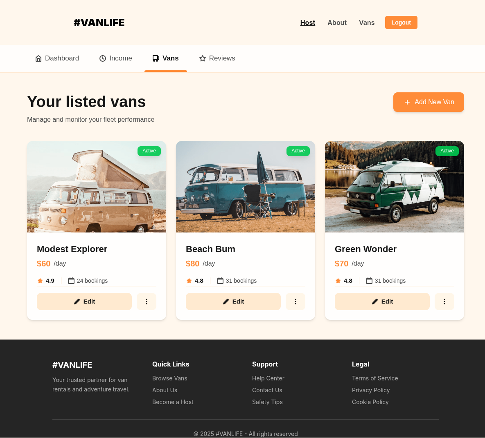
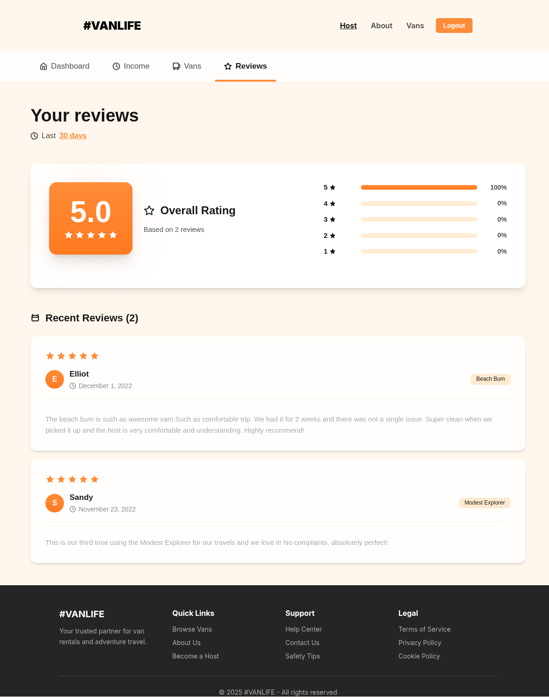

# Vanlife 🚐

A React-based van rental marketplace application built to practice React Router concepts. Browse available vans, view detailed listings, and manage rentals through an intuitive interface.

## Link To Website
Visit the website [website](https://quiet-rabanadas-3dba69.netlify.app/)

## Screenshots

### Home Page


### About Page


### Van Listings


### Login Page


### Host Dashboard


### Host Income


### Host Vans Management


### Host Reviews


## Features

- **Van Listings**: Browse a curated collection of available rental vans
- **Detailed Views**: View comprehensive information about each van including photos, pricing, and amenities
- **User Authentication**: Secure login system for accessing host features
- **Host Dashboard**: Manage your van listings with income tracking and reviews
- **Responsive Design**: Mobile-first design optimized for all devices
- **React Router Navigation**: Seamless single-page application routing with nested routes

## Tech Stack

- **Frontend**: React.js 18.2.0
- **Routing**: React Router v6.4.3
- **Styling**: CSS (Mobile-first modular architecture)
- **Icons**: React Icons 5.5.0
- **Backend**: Firebase 12.1.0 (Firestore) + MirageJS 0.1.46 (mock auth server)
- **Build Tool**: Vite (latest)
- **Package Manager**: npm

## Getting Started

### Prerequisites

- Node.js (version 16 or higher)
- npm

### Installation

1. Clone the repository
```bash
git clone https://github.com/IsahiRea/van-life.git
cd van-life
```

2. Install dependencies
```bash
npm install
```

3. Start the development server
```bash
npm run dev
```

4. Open your browser and navigate to `http://localhost:5173`

## Demo Account

For testing purposes, use these credentials:
- **Email**: b@b.com
- **Password**: p123

## Project Structure

```
vanlife/
├── src/
│   ├── components/        # Reusable UI components (Header, Footer, Layout, etc.)
│   ├── pages/            # Route components (Home, About, Vans, Host pages)
│   │   ├── Host/         # Host dashboard and van management pages
│   │   └── Vans/         # Public van listing and detail pages
│   ├── css/              # Modular CSS architecture
│   │   ├── base/         # Reset and utility styles
│   │   ├── components/   # Component-specific styles
│   │   ├── pages/        # Page-specific styles
│   │   │   └── host/     # Host page styles
│   │   └── main.css      # CSS entry point
│   ├── assets/           # Static assets and images
│   ├── api.js            # Firebase API functions
│   ├── server.js         # MirageJS mock authentication server
│   ├── utils.js          # Utility functions (requireAuth, etc.)
│   └── index.jsx         # Main application entry & route definitions
└── index.html            # Root HTML file
```

## Available Scripts

- `npm run dev` - Start development server
- `npm run build` - Build for production
- `npm run preview` - Preview production build locally

## Key Features Implementation

This project demonstrates:
- **React Router v6** with loader-based data fetching
- **Dynamic routing** with URL parameters and nested routes
- **Protected routes** with authentication guards
- **Firebase Firestore** integration for data persistence
- **Nested routing structures** for complex layouts (Host dashboard)
- **Mobile-first responsive design** with CSS media queries
- **Modular CSS architecture** for better maintainability and scalability
- **State preservation** across navigation using location.state
- **Icon integration** using react-icons library

## Routes

### Public Routes
- `/` - Home page
- `/about` - About page
- `/vans` - Browse all available vans
- `/vans/:id` - Individual van details
- `/login` - User authentication

### Protected Routes (Host Dashboard)
- `/host` - Host dashboard overview
- `/host/income` - Income tracking
- `/host/reviews` - Customer reviews
- `/host/vans` - Manage van listings
- `/host/vans/:id` - Van management (Info, Pricing, Photos)

Built with ❤️ as a React Router learning exercise